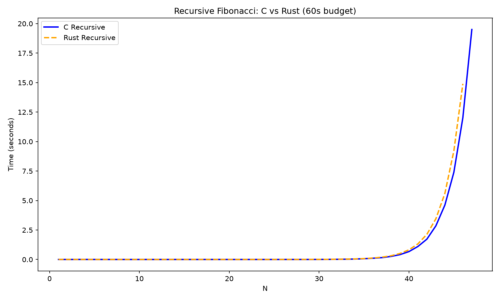
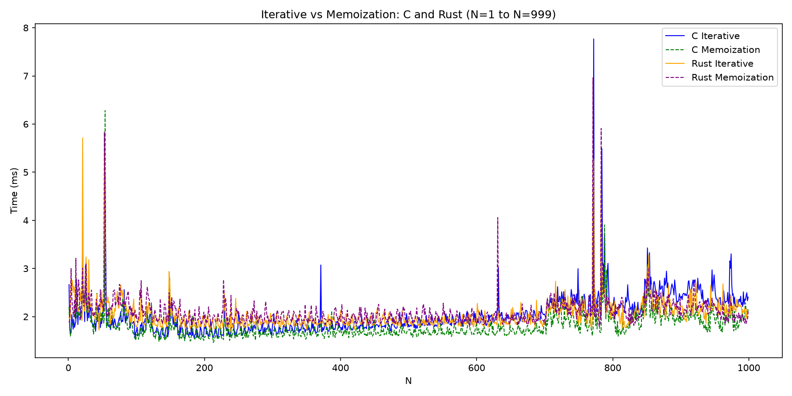

# Midterm p1: Report on Analysis of Fibonacci  Series
* **Author**: Sabastian Mandell
* **GitHub Repo**: https://github.com/Su26-CS5008-Online-Lionelle/midterm-test-b-byte.git
* **Semester**: Summer 2026 Workbook style, Asynchrounous 
* **Languages Used**: c, rust

> 


## Overview
The Fibonacci sequence is one of the most well-known and common sequences, not simply due to its simplicity, but its aesthetic appeal and common representation in art, biology, and math. Each term is derived by adding the previous two terms together. One fun fact is that the ratio of the terms gradually approaches the golden ratio of 1.618! My personal theory is that while seemingly mystical and magical, it is actually highly conserved in nature because of its simplicity and practicality, whether that's as the architecture of calcium deposits in a snail shell, or the distribution of leaves in a plant seeking to maximize sun exposure for photosynthesis. (These are my thoughts, not scientific facts to be referenced.)
In this report/assignment we used the languages C and Rust to analyze three different methods of computing this sequence: iteratively, recursively, and dynamically (via memoization). 


### Pseudocode
Because we had already written various versions of the Fibonacci sequence in CS 5001, I simply used those old Python scripts as my pseudocode.
```python
def fibonacci(n): //recieve int
    x = 0
    while x < n: // set base cases
        if x <= 1:
            y = 1
        else: //build answer.
            y = final[x - 1] + final[x - 2] //recursive sums for next term
        final.append(y)
        x += 1
    print(final)
```

Iterative: Receive n, base case, add 1 through n.

DP: See CS 5008 Starter Code: Coding Fibonacci with Memoization.

##Big(O)

| Version |  Big O | Space Used | 
| :-- | :-- |  :-- |
| Iterative | $O(n)$ | $O(1)$ |
| Recursive | $O(2^n)$  | $O(n)$ |
| Dynamic Programming | $O(n)$ | $O(n)$ |

Big O Notation
Big O notation is a very simple concept. In infinite sequences or long series, in order to classify the rate of growth, we actually classify the equation based on its fastest-growing variable. We study this in standard calculus courses as well, and in CS this is actually the same concept — we refer to it as "Big O notation" and can use it to describe the length of time a program might run or how much space it might require.
For example, in the iterative approach, we know the time required will be proportionate with n. So while the total time isn't fixed, it does grow very proportionately. However, the space required doesn't increase, because we can do our additions locally between n₁, n₂, and current. Despite multiple iterations, we don't need to expand our space requirements.


Iterative Code Snippet
```c
for (int i = 3; i <= n; i++) {
    // time increases with n
    long long current = n_1 + n_2;
    // space does not increase
    (*opC)++;
    n_1 = n_2;
    n_2 = current;
}
```

Next lets take a look at a Recursive tequnique. We can see that a recusive (non-DP) called program actually has exponential growth in terms of compute. because for every kth term "n", we actually need to call the same program 2 more times. so if n is 9, it'll call n(8) and n(7), and each of these will call two more recurrences and so with their calls. 

```rust
fn fibrec(n: u64, op_c: &mut u64) -> u64 {
    if n <= 2 { return 1; }
    let x: u64 = fibrec(n-1, op_c) + fibrec(n-2, op_c); // so the time spent calculating is increaseed //to the ^nth degree as n increases
    *op_c += 1;
    x
}
```
Slightly surprising given how many computations are being made is that the actual space doesn't grow at the same rate. Becasue these sre function calls and arent needing allocated memory, the space is required stays proportionate with n, hence we have O(n). Each fucntion call runs its calculation on the stack then pops off and sends its return. So while a pure recursive call has exponential growth in time computing all the limbs, it doesnt require expanded space.

View for Memoization
Simialr to regular recursion, DP technique has a space usage of O(n). While its proabbly a bit bigger, maybe more close to 2n, in an extended or infinite series once more we classify our system based on the variable of relative growth. In essence 2n and n are basically the same size. What's real impressive about DP memoized recusion is the the drastic reduction in time (form O(2^n) to O(n).

```rust
if let Some(val) = memo.get(&n) {
    return *val; 
}
let current = fibmem(n-1, memo, op_c) + fibmem(n-2, memo, op_c);
*op_c += 1;
memo.insert(n, current); // every time we compute something we store it In this case in Hashmap.
```
We accomplihs this by ensuring we only do each calculation 1x. Before we complete the calulation, we check in our Hashmap to see if we've already done it. If not then the program does the calculation ans stores the value in the table. But if our quick check says we already know the answer, the program basically skips the calculation and keeps moving. In this way the exponetial growth we got in recusion is real simply stopped, and out processing time end up growing proportinately to n.

## Empirical Data & Discussion 

The analysis is best summarized by a simple look at the operations count (chart below). Everything here is straightforward. The first thing I did was run each program through the first 30 terms, recording only operation counts into a spreadsheet. Within each implementation (as referenced in the code folders) I added an operations counter that incremented by 1 every time a calculation was completed. While language comparisons are saved for the language section, one thing worth noting is that our data matches expectations. The only striking observation is seeing just how quickly an exponential operation like standard recursion grows. We can expect these patterns to be mirrored in processing speed as well. Operations wise memo is slighty less then iterative, but again, in a long series, n vs 2 or even 5n is basically considered the same so they both indicate being O(n).

Operations Count Across tehcniques and languages:

| N | C Iterative | C Recursive | C Memoization | Rust Iterative | Rust Recursive | Rust Memoization |
|---|-------------|-------------|---------------|----------------|----------------|------------------|
| 1 | 0 | 0 | 0 | 0 | 0 | 0 |
| 2 | 0 | 0 | 0 | 0 | 0 | 0 |
| 3 | 1 | 1 | 1 | 1 | 1 | 1 |
| 4 | 3 | 3 | 1 | 3 | 3 | 2 |
| 5 | 6 | 7 | 1 | 6 | 7 | 3 |
| 6 | 10 | 14 | 4 | 10 | 14 | 4 |
| 7 | 15 | 26 | 3 | 15 | 26 | 5 |
| 8 | 21 | 46 | 4 | 21 | 46 | 6 |
| 9 | 28 | 79 | 5 | 28 | 79 | 7 |
| 10 | 36 | 133 | 6 | 36 | 133 | 8 |
| 11 | 45 | 221 | 7 | 45 | 221 | 9 |
| 12 | 55 | 364 | 7 | 55 | 364 | 10 |
| 13 | 66 | 596 | 8 | 66 | 596 | 11 |
| 14 | 78 | 972 | 9 | 78 | 972 | 12 |
| 15 | 91 | 1581 | 10 | 91 | 1581 | 13 |
| 16 | 105 | 2567 | 12 | 105 | 2567 | 14 |
| 17 | 120 | 4163 | 13 | 120 | 4163 | 15 |
| 18 | 136 | 6746 | 14 | 136 | 6746 | 16 |
| 19 | 153 | 10926 | 15 | 153 | 10926 | 17 |
| 20 | 171 | 17690 | 16 | 171 | 17690 | 18 |
| 21 | 190 | 28635 | 17 | 190 | 28635 | 19 |
| 22 | 210 | 46345 | 18 | 210 | 46345 | 20 |
| 23 | 231 | 75001 | 19 | 231 | 75001 | 21 |
| 24 | 253 | 121368 | 20 | 253 | 121368 | 22 |
| 25 | 276 | 196392 | 21 | 276 | 196392 | 23 |
| 26 | 300 | 317784 | 22 | 300 | 317784 | 24 |
| 27 | 325 | 514201 | 23 | 325 | 514201 | 25 |
| 28 | 351 | 832011 | 24 | 351 | 832011 | 26 |
| 29 | 378 | 1346239 | 25 | 378 | 1346239 | 27 |
| 30 | 406 | 2178278 | 26 | 406 | 2178278 | 28 |


THE GREAT RECUSION RACE!
 Given that recursion carries an anticipated computational tax, I decided to see which language handled it better with a simple race. Each program was given a maximum allotment of 60 seconds to compute as many N-th terms as possible. The time of each successful computation was also recorded. This is probably the only interesting or unexpected thing thats come up: C is reasonably faster then Rust in a compute heavy assingment. Could proabbly run other tests or more iterations to get statsitical significance. 

 

| N | C Time (s) | Rust Time (s) |
|---|------------|---------------|
| 1 | 0.0048 | 0.0057 |
| 2 | 0.0025 | 0.0032 |
| 3 | 0.0043 | 0.0028 |
| 4 | 0.0053 | 0.0031 |
| 5 | 0.0039 | 0.0022 |
| 6 | 0.0029 | 0.002 |
| 7 | 0.0029 | 0.0025 |
| 8 | 0.002 | 0.002 |
| 9 | 0.0019 | 0.0022 |
| 10 | 0.0025 | 0.0019 |
| 11 | 0.002 | 0.0023 |
| 12 | 0.002 | 0.0021 |
| 13 | 0.0027 | 0.002 |
| 14 | 0.0031 | 0.002 |
| 15 | 0.0029 | 0.0028 |
| 16 | 0.0024 | 0.003 |
| 17 | 0.0031 | 0.0023 |
| 18 | 0.0027 | 0.0023 |
| 19 | 0.0031 | 0.0021 |
| 20 | 0.0024 | 0.002 |
| 21 | 0.0022 | 0.002 |
| 22 | 0.0021 | 0.0023 |
| 23 | 0.0022 | 0.0024 |
| 24 | 0.002 | 0.0023 |
| 25 | 0.0022 | 0.003 |
| 26 | 0.0048 | 0.0034 |
| 27 | 0.0032 | 0.0035 |
| 28 | 0.0043 | 0.0047 |
| 29 | 0.0054 | 0.0064 |
| 30 | 0.0073 | 0.009 |
| 31 | 0.0112 | 0.0133 |
| 32 | 0.0164 | 0.0208 |
| 33 | 0.0249 | 0.0309 |
| 34 | 0.0389 | 0.0481 |
| 35 | 0.0652 | 0.0764 |
| 36 | 0.107 | 0.1234 |
| 37 | 0.1585 | 0.196 |
| 38 | 0.2605 | 0.3154 |
| 39 | 0.4125 | 0.507 |
| 40 | 0.6709 | 0.819 |
| 41 | 1.1044 | 1.3253 |
| 42 | 1.7274 | 2.1376 |
| 43 | 2.8563 | 3.456 |
| 44 | 4.6158 | 5.6062 |
| 45 | 7.3943 | 9.2071 |
| 46 | 12.0185 | 14.8947 |
| 47 | 19.5024 | DNF |


## Iterative vs DP (Speed)



As we saw from the operations count, the overall difference in speed between the iterative and dynamic memoized recursive techniques is minimal. We see a flat curve with occasional spikes, but these are more indicative of the computer being interrupted by other processes suddenly consuming resources. The overall trend remains flat. This is once more empirical data confirming our O(n) analysis of iterative and dynamic programming techniques. We see a gradual increase as n grows, with slight variations in efficiency between languages, but overall the increase is gradual and proportionate.

## Language Analysis

I chose Rust because at recent hackathons I kept hearing people talk about switching to it for efficiency and security. I didn't know much about it going in. I had used Python before but ultimately decided it would be more interesting to explore something new and get a broader sense of what programming languages share in common and where they diverge. I've studied a lot of human languages too, so maybe that's why I assumed the translation would be manageable.

The rubirc says things about concerns and limitations. I didn't have any... I found very few limitations. I did notice that coincidentally I maty have chosen the two most alike languages though by accident, but I could be totally wrong. They are both heavily typed languages and use poitners. As for the limits, this assignemnt didn't exactly strike me as anything crazy prgoramming-wise. I've studied alot of human languages too, so maybe thats why I just assume it's all gunna be fine and translatable.

### Language 1: C
C was faster the rust. It made it further in my recursion race/ time limit test. While not notably further (only 1 term), it was processing faster by the mid 30's. C was easier to write in then rust, not just becuase the syntax was familiar, but it as a bit shorter. Rust syntax is longer however I found Rust more intuitive. Rubric says I need to give snippets:

```c
long long fibmem(int n, long long *memo, int *opC) {
    if(n <= 2) {
        memo[n] = 1;
    }
    if (memo[n] != 0 || n == 0) {
        return memo[n];
    }
    // recursive portion
    memo[n] = fibmem(n-1, memo, opC) + fibmem(n-2, memo, opC);
    (*opC)++;
    return memo[n];
}
```

Anyways I noticed at mid 30's?? I dont remember now that I get overflow adn start popping negative numbers. So I went back and made thing long long instead of int. Even then, one LIMITAION I found was that after 93rd term we'd get negatives back anyways.


### Language 2: RUST
 Rust.. rust was kind of cool. I mean it was a pain to have to spend extra time translating inital C or Sudo code into a new syntax but all in all it was that wild. It is heavily typed, but i felt the Rust language was sort of more articulated, like take 2 examples out of the follpwing snippet for example:

 ```rust
fn fibmem(n: u64, memo: &mut HashMap<u64, u64>, op_c: &mut u64) -> u64 {
```
My brainn could actually read it explicitly:
Function Fibonacci Memo(N tha variable: type u64, name memo: type address and mutable Hashtable (dimensions). operationc outner: type cubby box, mutable 64 int)

Like to me its a bit clunky but its almost human language,and less method.

take a C for loop {element start at; go until; change by) - this isnt bad, but it descirbes a process, not explicit language, but rust loop:

```rust
for i in 1..=n {
    println!("term {}: {}", i, fibmem(i, &mut memo, &mut op_c));
}
```

for element in each from 1 through n ( print("term {}", i in {}. This may even sound  like gibberish to you as you read it, but in my mind reading Rust is like a caveman talking to me haha.
There may be some control missing, some flexabillity thats not totally accouted for that I could see in a C loop, but this is easier to just... human translate in my opinion becuase its almost dummified human logic speech, not process encoding.

### Comparison and Discussion Between Experiences

Comparison and Discussion? Isn't that exactly what we just did for multiple paragraphs. I enjoyed writng different iterations fo the fibbonacci sequence and even exploring a new language. It was fun to see similarities, differences, and also really study the algorythmic structures and techniques. 


## Conclusions / Reflection
I'll do a more detialed reflection in the reflection assignment. In conlclusion, recuson is exponential, memoization is remakrably effective and making a highly ineffiecnt process extremely efficient. Languages have unqie advantages and disadvantages but often share a tremendous amount of functionality and conceptual applications.

## LLM Use Disclosure 

I used LLM (Normal Claude, not Claude code) for debugging, dialogue and duck programmings, syntax checking and translating and extensively in trying to build python programs to make graphs out of the data because Im not good with excel and wasted way to much time on these charts anyways. Used also for spell check and grammar touch ups, systems navigation and understanding things like Markdown, matplotlib, running programs 1-999 times and recording data in an excel so i didn;t have to sit there and click and record data poitns for hours on end. Etc etc. Oh and unit tests.

## References

[1] The Rust Project Developers. 2024. std::time::Instant. The Rust Standard Library. Retrieved from https://doc.rust-lang.org/std/time/struct.Instant.html

[2] Portfolio Courses. 2022. Time Library | C Programming Tutorial. YouTube. Retrieved from https://www.youtube.com/watch?v=Qoed2uBwF_o

[3] The Rust Project Developers. 2024. std::time::Instant. The Rust Standard Library. Retrieved from https://doc.rust-lang.org/std/time/struct.Instant.html
